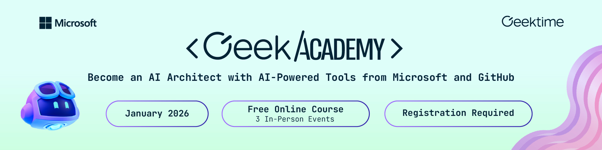

<p align="center">
  
</p>

<h1 align="center">Microsoft Agent Framework - Multi-Agent Content Pipeline</h1>

<p align="center">
  <strong>A hands-on POC demonstrating multi-agent orchestration with MCP tools, A2A protocol, and Azure AI Foundry</strong>
</p>

<p align="center">
  <a href="#what-youll-learn">What You'll Learn</a> &bull;
  <a href="#architecture">Architecture</a> &bull;
  <a href="#prerequisites">Prerequisites</a> &bull;
  <a href="#quick-start">Quick Start</a> &bull;
  <a href="#project-structure">Project Structure</a> &bull;
  <a href="#a2a-protocol-demo">A2A Demo</a> &bull;
  <a href="#tracing--observability">Tracing</a>
</p>

<p align="center">
  
  
  
  
  
  
</p>

---

## Deploy to Azure

[](https://portal.azure.com/#create/Microsoft.Template/uri/https%3A%2F%2Fraw.githubusercontent.com%2Fmsftse%2Fmicrosoft-agent-framework-geekacademy%2Fmain%2Fazuredeploy.json)

> Deploys an Azure AI Foundry project with a `gpt-4o` model deployment and Application Insights for tracing.

---

## Overview

This project demonstrates how to build a **multi-agent content creation pipeline** using the [Microsoft Agent Framework](https://github.com/microsoft/agent-framework) for Python. Three AI agents collaborate in sequence to research, write, and review technical articles — powered by Azure AI Foundry and connected to live data sources via MCP (Model Context Protocol) tools.

### What You'll Learn

- Creating AI agents with `AzureAIAgentClient`
- Connecting agents to external tools via **MCP** (Streamable HTTP and stdio)
- Orchestrating agents in a **sequential workflow** using `SequentialBuilder`
- Streaming agent outputs with real-time handoff visibility
- Exposing and consuming agents via the **A2A (Agent-to-Agent) protocol**
- Setting up **Azure Monitor tracing** for observability in AI Foundry

---

## Architecture

```
                    ┌─────────────────────────────┐
                    │     Sequential Workflow      │
                    └─────────────────────────────┘
                                  │
          ┌───────────────────────┼───────────────────────┐
          ▼                       ▼                       ▼
   ┌─────────────┐       ┌──────────────┐       ┌──────────────┐
   │  Researcher  │       │    Writer     │       │   Reviewer   │
   │              │       │              │       │              │
   │  Gathers     │──────▶│  Transforms  │──────▶│  Polishes    │
   │  information │       │  into article│       │  final draft │
   └──────┬───────┘       └──────────────┘       └──────────────┘
          │
    ┌─────┴─────┐
    ▼           ▼
┌────────┐ ┌────────┐
│MS Learn│ │ GitHub │
│  MCP   │ │  MCP   │
│ (HTTP) │ │(stdio) │
└────────┘ └────────┘
```

| Agent | Role | MCP Tools |
|-------|------|-----------|
| **Researcher** | Gathers facts, docs, and code examples on the topic | Microsoft Learn, GitHub |
| **Writer** | Transforms the research brief into a developer-friendly article | None |
| **Reviewer** | Edits for accuracy, clarity, and structure; outputs the final version | None |

---

## Prerequisites

- **Python 3.10+**
- **Node.js 18+** (for the GitHub MCP server via `npx`)
- **Azure CLI** — logged in (`az login`)
- **Azure AI Foundry project** with a deployed model (e.g., `gpt-4o`)
- **GitHub Personal Access Token** — [create one here](https://github.com/settings/tokens)

---

## Quick Start

### 1. Clone the repository

```bash
git clone https://github.com/msftse/microsoft-agent-framework-geekacademy.git
cd microsoft-agent-framework-geekacademy
```

### 2. Install dependencies

```bash
pip install -r requirements.txt
# or using pyproject.toml
pip install .
```

Or install directly:

```bash
pip install "agent-framework[azure]" azure-identity azure-monitor-opentelemetry opentelemetry-sdk python-dotenv
```

### 3. Configure environment

```bash
cp .env.example .env
```

Edit `.env` with your values:

```env
# Required - Azure AI Foundry project endpoint
PROJECT_ENDPOINT=https://<your-resource>.services.ai.azure.com/api/projects/<your-project>
MODEL_DEPLOYMENT_NAME=gpt-4o

# Required - GitHub MCP server
GITHUB_PERSONAL_ACCESS_TOKEN=ghp_xxxxxxxxxxxxxxxxxxxx

# Optional - Azure Monitor tracing (leave empty for console output)
APPLICATION_INSIGHTS_CONNECTION_STRING=
```

> **Finding your project endpoint:** In [Azure AI Foundry](https://ai.azure.com), open your project → Settings → Project endpoint.

### 4. Login to Azure

```bash
az login
```

### 5. Run the pipeline

```bash
python run.py
```

Or as a module:

```bash
python -m pipeline.main
```

You'll be prompted to enter a topic (or press Enter for the default). The pipeline will stream output from each agent in sequence:

```
[Researcher]:
<research brief with docs and code examples>
----------------------------------------
[Writer]:
<developer-friendly article>
----------------------------------------
[Reviewer]:
<final polished version>

============================================================
Pipeline complete!
```

---

## Project Structure

```
├── .env.example          # Environment variable template
├── .gitignore            # Protects .env and caches
├── pyproject.toml        # Dependencies and project metadata
├── run.py                # Entry point — python run.py
├── pipeline/
│   ├── __init__.py
│   ├── config.py          # Loads and validates settings from .env
│   ├── tracing.py         # Azure Monitor or console tracing setup
│   ├── tools.py           # MCP tool factories (Learn HTTP + GitHub stdio)
│   ├── agents.py          # Agent definitions (Researcher, Writer, Reviewer)
│   ├── workflow.py        # SequentialBuilder pipeline
│   └── main.py            # Async entry point — wires everything together
└── a2a_demo/
    ├── __init__.py
    ├── server.py          # Exposes Reviewer agent as A2A server
    └── client.py          # Consumes the remote agent via A2A protocol
```

### Key Files Explained

| File | What It Does |
|------|-------------|
| `config.py` | Reads `.env`, validates required settings, returns a frozen `Settings` dataclass |
| `tracing.py` | Configures OpenTelemetry — Azure Monitor exporters when `APPLICATION_INSIGHTS_CONNECTION_STRING` is set, console output otherwise |
| `tools.py` | Creates two MCP tools: **Microsoft Learn** (Streamable HTTP) and **GitHub** (stdio via `npx`) |
| `agents.py` | Defines three agents using `AzureAIAgentClient.as_agent()` with role-specific system prompts |
| `workflow.py` | Chains agents into a sequential workflow using `SequentialBuilder` |
| `main.py` | Orchestrates startup: config → tracing → client → MCP tools → agents → workflow → stream output |

---

## Tracing & Observability

The pipeline supports two tracing modes:

### Azure Monitor (recommended)

Set `APPLICATION_INSIGHTS_CONNECTION_STRING` in your `.env`. Traces appear in the **Azure AI Foundry portal** under your project's tracing tab, showing:

- Full workflow span with latency
- Per-agent execution spans (Researcher, Writer, Reviewer)
- Chat completion calls to `gpt-4o`
- MCP tool invocations

### Console (local dev)

Leave `APPLICATION_INSIGHTS_CONNECTION_STRING` empty. Spans are printed to stdout for quick debugging.

---

## How It Works

1. **Config** — `load_settings()` reads `.env` and validates required values
2. **Tracing** — `setup_tracing()` configures OpenTelemetry with Azure Monitor or console exporters via `configure_otel_providers()`
3. **Client** — `AzureAIAgentClient` connects to Azure AI Foundry using `AzureCliCredential`
4. **MCP Tools** — Microsoft Learn (HTTP) and GitHub (stdio) servers start as async context managers
5. **Agents** — Three agents are created with `client.as_agent()`, each with role-specific instructions
6. **Workflow** — `SequentialBuilder` chains Researcher → Writer → Reviewer
7. **Streaming** — `workflow.run_stream()` yields events showing real-time agent handoffs and text output

---

## A2A Protocol Demo

The project also includes a standalone demo of the [Agent-to-Agent (A2A) protocol](https://github.com/google/A2A) — an open standard for inter-agent communication over HTTP/JSON-RPC. The Microsoft Agent Framework supports A2A natively, allowing any agent to be exposed as a remote service or consumed as a remote participant.

### How It Works

```
Terminal 1 (Server)                    Terminal 2 (Client)
┌──────────────────────┐              ┌──────────────────────┐
│  Reviewer Agent      │    A2A       │  A2AAgent            │
│  (Azure AI Foundry)  │◀──JSON-RPC──│  (framework client)  │
│                      │              │                      │
│  Exposed via         │   HTTP       │  Calls remote agent  │
│  A2AStarletteApp     │──────────── ▶│  like a local one    │
│  on localhost:9000   │              │                      │
└──────────────────────┘              └──────────────────────┘
```

**Server** (`a2a_demo/server.py`):
- Creates a Reviewer agent using `AzureAIAgentClient`
- Wraps it in an `AgentExecutor` that bridges agent-framework to the A2A protocol
- Serves it via `A2AStarletteApplication` + `uvicorn` on `localhost:9000`
- Publishes an **Agent Card** at `/.well-known/agent-card.json` describing its capabilities

**Client** (`a2a_demo/client.py`):
- Creates an `A2AAgent(url="http://localhost:9000")` — same interface as any local agent
- Sends a draft article for review over the A2A protocol
- Receives the polished article back

### Run the Demo

**Terminal 1** — Start the A2A server:
```bash
python -m a2a_demo.server
```

**Terminal 2** — Run the A2A client:
```bash
python -m a2a_demo.client
```

> The client sends a sample draft article with intentional issues. The remote Reviewer agent reviews and polishes it, returning the result over A2A.

### Why A2A Matters

- **Interoperability** — Agents built with different frameworks can communicate via the standard A2A protocol
- **Remote execution** — Agents can run on separate machines/services and collaborate over HTTP
- **Discovery** — Agent Cards let clients discover agent capabilities automatically
- **Same interface** — `A2AAgent` implements the same protocol as local agents, so it plugs into workflows and tools seamlessly

---

## Technologies

| Technology | Usage |
|-----------|-------|
| [Microsoft Agent Framework](https://github.com/microsoft/agent-framework) | Agent creation, workflows, MCP integration |
| [Azure AI Foundry](https://ai.azure.com) | LLM hosting (gpt-4o), tracing, project management |
| [Model Context Protocol (MCP)](https://modelcontextprotocol.io) | Tool connectivity — Microsoft Learn & GitHub |
| [Agent-to-Agent Protocol (A2A)](https://github.com/google/A2A) | Inter-agent communication over HTTP/JSON-RPC |
| [Azure Monitor / OpenTelemetry](https://learn.microsoft.com/en-us/azure/azure-monitor/) | Distributed tracing and observability |
| [Azure Identity](https://learn.microsoft.com/en-us/python/api/azure-identity/) | Authentication via Azure CLI credential |

---

## Troubleshooting

| Issue | Solution |
|-------|---------|
| `ModuleNotFoundError: No module named 'pipeline'` | Run from the project root: `python run.py` or `python -m pipeline.main` |
| `EnvironmentError: PROJECT_ENDPOINT is required` | Copy `.env.example` to `.env` and fill in your Azure AI Foundry project endpoint |
| `401 Unauthorized` | Run `az login` to refresh your Azure CLI credential |
| GitHub MCP server hangs | Ensure Node.js 18+ is installed and `npx` is available in your PATH |
| Traces not appearing in AI Foundry | Verify `APPLICATION_INSIGHTS_CONNECTION_STRING` is correct; traces may take 1-2 minutes to appear |

---

## License

MIT

---

<p align="center">
  Built for <strong>Geek Academy</strong> — Become an AI Architect with AI-Powered Tools from Microsoft and GitHub
</p>
